# Bài 2: Mã hoá, triển khai PKI

Gồm 2 phần thực hành:

| Thư mục | Nội dung | Sách |
|---|---|---|
| `crypto-toolkit/` | Thư viện `securecrypto`: AES-256-GCM, RSA, Argon2, kèm CLI, GUI (Tkinter), API (Flask) | 2.2 (trang 36–47) |
| `mini-ca/` | CA đơn giản: Root CA, Intermediate CA, cấp chứng chỉ end-entity, xác thực chuỗi, thu hồi (CRL), kiểm tra trạng thái | 2.4 (trang 50–64) |
| `screenshots/` | Ảnh kết quả chạy thực tế | |

Môi trường chạy: Windows 11, Python 3.14, venv `.venv` ở thư mục gốc repo.

---

## 1. crypto-toolkit

```
crypto-toolkit/
├── files/data.txt            # "HUTECH University"
├── securecrypto/
│   ├── __init__.py
│   ├── aes_utils.py          # encrypt_file_aes / decrypt_file_aes (AES-256-GCM, khoá từ PBKDF2)
│   ├── rsa_utils.py          # generate_rsa_keypair / sign_data_rsa / verify_signature_rsa
│   ├── hash_utils.py         # hash_password_secure (Argon2)
│   ├── cli.py                # securecrypto-cli
│   ├── app_gui.py            # GUI Tkinter
│   └── api.py                # Flask API /encrypt, /decrypt
├── tests/                    # pytest
├── requirements.txt
└── setup.py
```

Định dạng file `.enc`: `salt (16 byte) | nonce (12 byte) | ciphertext + GCM tag`.

### Cài đặt và chạy

```powershell
.\.venv\Scripts\Activate.ps1        # từ thư mục gốc repo; đầu dòng sẽ hiện (.venv)
cd Bai2\crypto-toolkit
pip install -e .
pip install -r requirements.txt     # pytest

# Unit test
pytest tests/ -v

# CLI: mã hoá sẽ in ra Key (base64); giải mã dùng Key đó hoặc password gốc
securecrypto-cli --encrypt .\files\data.txt --password pass123
securecrypto-cli --decrypt .\files\data.txt.enc --password <Key hoặc pass123>

# GUI
python securecrypto/app_gui.py

# API (http://127.0.0.1:5000), gửi form-data gồm file + password (Postman/curl)
python securecrypto/api.py
```

> Nếu PowerShell báo không tìm thấy `securecrypto-cli` (thư mục `Scripts` của
> venv không nằm trong PATH), dùng `python -m securecrypto.cli ...` thay thế.

### Kết quả

**Cài package và chạy Unit Tests (8 passed):**

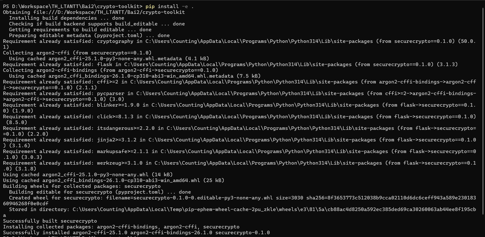
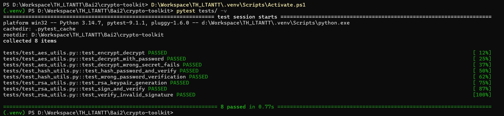

**CLI: mã hoá, sau đó giải mã bằng Key in ra.** File `.dec` khớp nội dung gốc:

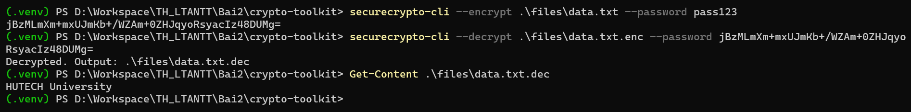

**CLI: giải mã bằng password gốc thì thành công, bằng password sai thì báo lỗi, không crash:**

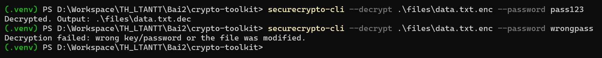

**Flask API:** Chạy server, dùng Postman gọi `POST /encrypt` (form-data gồm `file` và
`password`) để nhận Key, rồi gọi `POST /decrypt` với file `.enc` và Key đó để lấy file `.dec`.
Khi sai Key/password, API trả HTTP 400 kèm thông báo lỗi. Tên file dạng
`../../evil.txt` bị `secure_filename` đưa về `evil.txt` nên không ghi ra ngoài
thư mục `upload/` được (đã kiểm tra bằng curl).

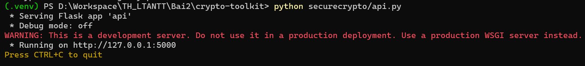
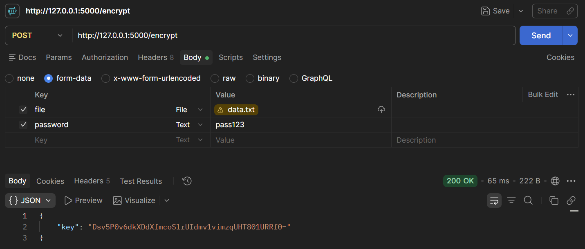
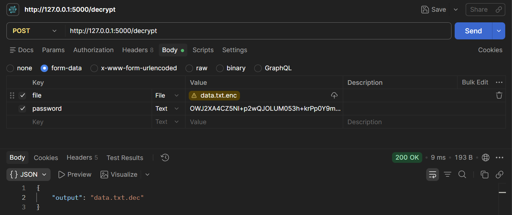

**GUI:** Nhập password rồi bấm Encrypt để hiện Key (Key cũng được copy vào clipboard).
Sau đó dán Key vào ô, bấm Decrypt và chọn file `.enc` để lấy file `.dec`:

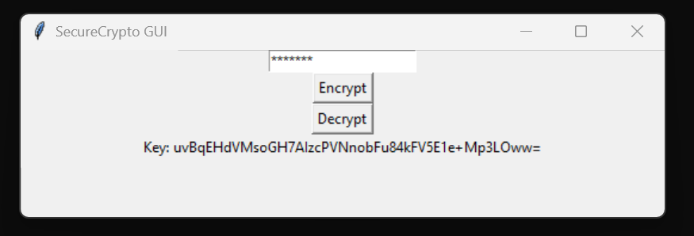
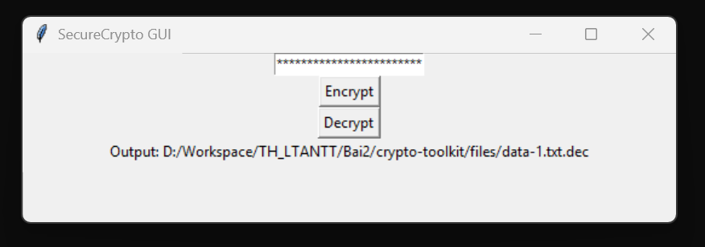

---

## 2. mini-ca

```
mini-ca/
├── ca_utils.py       # generate_key, save/load key-cert, create_root_ca, create_intermediate_ca,
│                     # issue_certificate, verify_certificate_chain
├── revoke_utils.py   # create_empty_crl, revoke_certificate, check_revocation_status
├── demo.py           # chạy toàn bộ luồng trên terminal
├── demo_ui.py        # giao diện Tkinter 5 nút
└── requirements.txt
```

Chuỗi chứng chỉ:

- Root CA: tự ký, hạn 10 năm, `BasicConstraints(ca=True, path_length=1)`.
- Intermediate CA: do Root ký, hạn 5 năm, `path_length=0`.
- End-entity `Phuoc_Nguyen`: do Intermediate ký, hạn 1 năm, `ca=False`.

Thu hồi được ghi vào CRL `certs/ca_crl.pem`, ký bằng khoá Intermediate.

### Chạy

```powershell
# (cần kích hoạt .venv như ở phần 1)
cd Bai2\mini-ca
pip install -r requirements.txt
python .\demo.py        # terminal
python .\demo_ui.py     # giao diện: bấm lần lượt nút 1 → 5
```

Khoá riêng và chứng chỉ sinh ra trong `mini-ca/certs/`. Thư mục này và `*.pem`
nằm trong `.gitignore` (sách trang 63) nên không bị commit.

### Kết quả

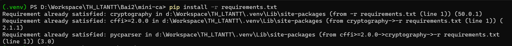

**demo.py:** Tạo Root và Intermediate CA, phát hành cert user, kiểm tra chuỗi hợp lệ
(`True`), thu hồi, rồi kiểm tra trạng thái thấy `Revoked`:

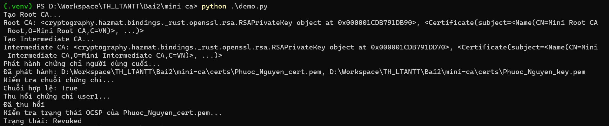

**Thư mục `certs/`** gồm các file `.pem` do `demo.py` sinh ra (khoá, chứng chỉ của Root, Intermediate, user và CRL `ca_crl.pem`):

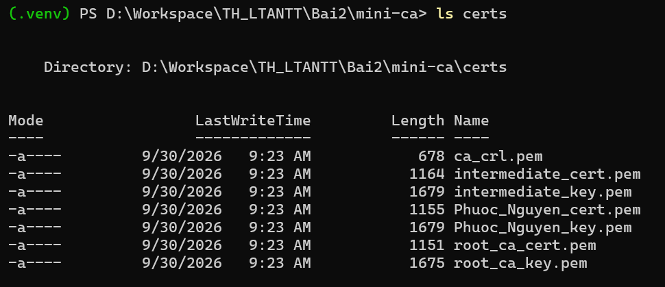

**demo_ui.py:** Bấm nút 1 để tạo CA, sau đó bấm tiếp các nút 2 → 5:

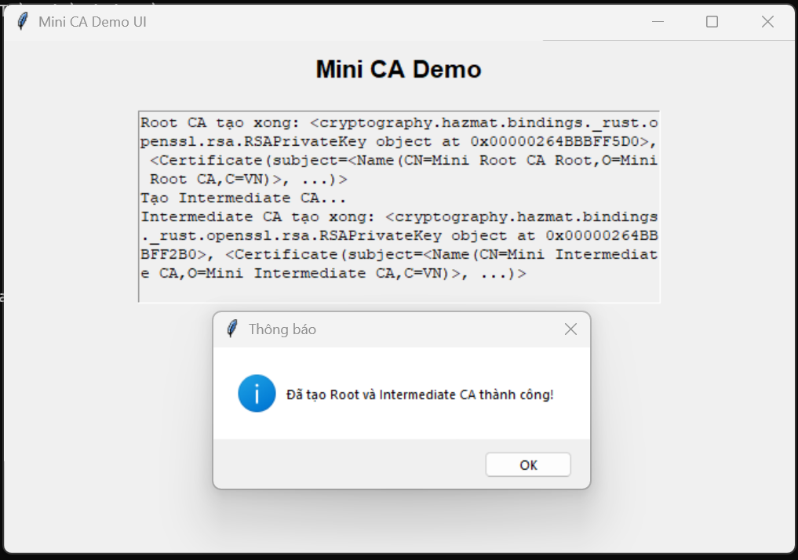
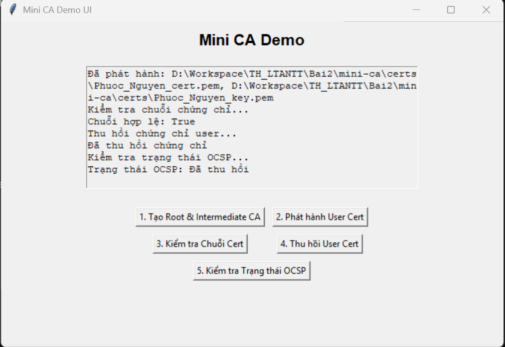

---

## Những điểm đã sửa so với code trong sách

Code chạy đúng theo các yêu cầu 2.2.1 và 2.4.1. Các chỗ khác sách đều có comment giải thích ngay tại dòng code.

**crypto-toolkit**

- `aes_utils.decrypt_file_aes`: nhận cả Key base64 (như sách) lẫn password gốc
  (theo yêu cầu 2.2.1 `decrypt_file_aes(encrypted_file, password)`). Sách dùng
  `replace('.enc', '.dec')`: nếu file không có đuôi `.enc` thì sẽ ghi đè lên chính
  nó. Code hiện tại chỉ cắt đuôi `.enc` ở cuối tên file.
- `api.py`: dùng `secure_filename` để chặn path traversal qua tên file upload.
  Thiếu `file`/`password` hoặc sai Key thì trả JSON lỗi 400 thay vì lỗi 500.
  Chỉ trả tên file output, không lộ đường dẫn tuyệt đối trên server.
- `cli.py`, `app_gui.py`: báo lỗi rõ ràng khi sai Key/password, không tìm thấy
  file, hoặc bấm Cancel. GUI copy Key vào clipboard vì Label của Tkinter không bôi đen để copy được.
- `tests/test_hash_utils.py`: mật khẩu test được sinh ngẫu nhiên, vì hook
  GitSecure (Bài 1) chặn commit có mật khẩu viết cứng (tình huống ở sách trang 47).

**mini-ca**

- `datetime.utcnow()` (bị gạch trong sách) đã deprecated, được thay bằng
  `datetime.now(timezone.utc)`.
- `CERTS_DIR` được neo theo thư mục chứa code, nên chạy từ thư mục nào cũng ghi vào `mini-ca/certs/`.
- `verify_certificate_chain`: sách chỉ kiểm chữ ký. Theo phần giải thích ở trang 55
  (hết hạn hay sai chuỗi cũng phải trả `False`), code kiểm thêm thời hạn, tên issuer,
  quyền CA (`BasicConstraints.ca`) và `path_length`.
- `revoke_certificate`: không thêm trùng serial khi thu hồi lại cùng một chứng chỉ,
  và bỏ CRL cũ còn sót lại nếu CRL đó do CA của lần tạo trước ký.
