# Bài 3: Bảo mật mạng máy tính

Gồm 2 phần thực hành:

| Thư mục | Nội dung | Sách |
|---|---|---|
| `secure-chat/` | Ứng dụng chat qua SSL/TLS: server đa luồng, client xác minh chứng chỉ (mTLS), mã hoá đầu-cuối tin nhắn bằng AES-256-CBC | 3.2 (trang 67–78) |
| `netrecon/` | Bộ công cụ trinh sát mạng: quét cổng, nhận dạng dịch vụ (Nmap), lấy banner, sơ đồ mạng (ARP), tra lỗ hổng theo cổng; có CLI, web Flask và gửi kết quả qua email | 3.4 (trang 80–93) |
| `screenshots/` | Ảnh kết quả chạy thực tế | |

Môi trường chạy: Windows 11, Python 3.14, venv `.venv` ở thư mục gốc repo.

Công cụ cần cài thêm (thêm vào PATH, sau đó khởi động lại VS Code):

- **OpenSSL** (Win64 OpenSSL Light, https://slproweb.com/products/Win32OpenSSL.html).
  Thư mục cần thêm vào PATH là `C:\Program Files\OpenSSL-Win64\bin`.
- **Nmap** (https://nmap.org/download.html, cài kèm Npcap). Thêm `C:\Program Files (x86)\Nmap` vào PATH.

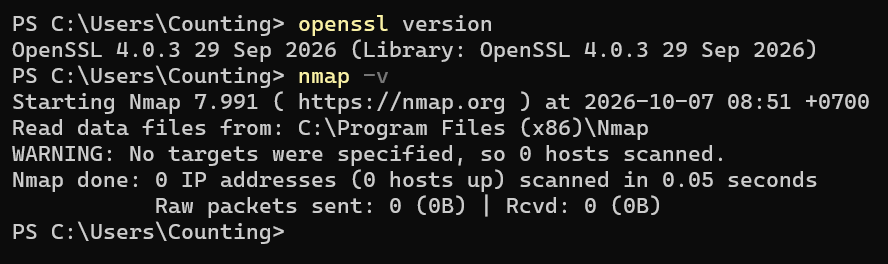

---

## 1. secure-chat

```
secure-chat/
├── openssl.cnf               # cấu hình Root CA (CA:true, keyCertSign, cRLSign)
├── make-certs.bat            # sinh CA, cert server (CN=localhost), cert client (CN=client)
├── message_encryption.py     # MessageEncryption: AES-256-CBC + PKCS7, output = IV (16 byte) | ciphertext
├── connection_manager.py     # ConnectionManager: socket -> {username, encryption_key}, có lock
├── room_manager.py           # RoomManager: tạo/vào/rời phòng, broadcast trong phòng
├── server.py                 # SecureChatServer: TLS 1.2+, bắt buộc client có cert do CA ký
└── client.py                 # SecureChatClient: xác minh cert server bằng ca.crt, gửi cert client
```

Luồng hoạt động:

1. Client và server bắt tay TLS. Mỗi bên kiểm tra chứng chỉ của bên kia bằng `certs/ca/ca.crt` (mutual TLS).
2. Client sinh khoá AES-256 ngẫu nhiên và gửi `username:key_hex` cho server qua kênh TLS.
3. Mỗi tin nhắn được client mã hoá AES rồi gửi đi. Server giải mã bằng khoá của người gửi,
   sau đó mã hoá lại bằng khoá riêng của từng client nhận và chuyển tiếp.

### Chạy

```powershell
.\.venv\Scripts\Activate.ps1        # từ thư mục gốc repo; đầu dòng sẽ hiện (.venv)
pip install cryptography
cd Bai3\secure-chat
.\make-certs.bat                    # sinh certs\ca, certs\server, certs\client

python server.py                    # terminal 1
python client.py                    # terminal 2, 3, ... (mỗi terminal đều phải kích hoạt .venv)
```

Phải chạy `server.py`/`client.py` từ trong `secure-chat/`, vì đường dẫn `certs/...`
trong code là đường dẫn tương đối. Thư mục `certs/` nằm trong `.gitignore` nên không bị commit.

### Kết quả

**Sinh chứng chỉ bằng `make-certs.bat`:**

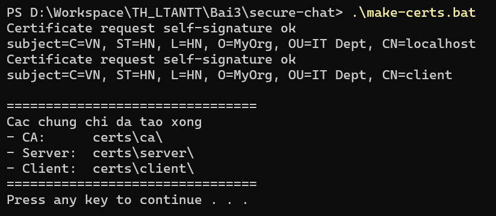
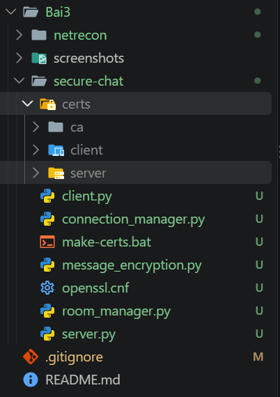

**Server và một client.** Server hiện `DeprecationWarning` cho `OP_NO_TLSv1*` (ảnh trong sách cũng có),
in tin nhắn đã giải mã và ghi nhận khi client ngắt kết nối:

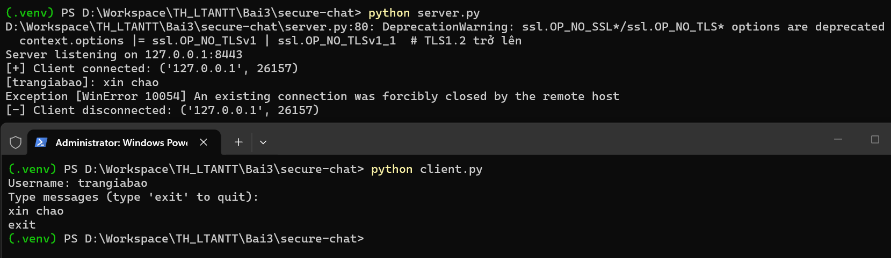

**Hai client chat với nhau.** Tin nhắn của client này hiện ở client kia kèm tên người gửi:

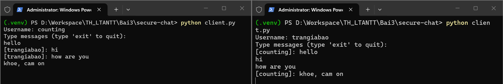

---

## 2. netrecon

```
netrecon/
├── modules/
│   ├── __init__.py
│   ├── port_scanner.py       # PortScanner: quét TCP connect bất đồng bộ, giới hạn đồng thời bằng Semaphore
│   ├── service_detector.py   # ServiceDetector: gọi `nmap -sV`
│   ├── banner_grabber.py     # BannerGrabber: kết nối, đọc 1024 byte đầu, timeout 2s
│   ├── network_mapper.py     # NetworkMapper: `arp -a`
│   ├── vuln_checker.py       # VulnChecker: tra bảng CVE theo số cổng
│   ├── filter_utils.py       # whitelist / blacklist IP
│   └── email_sender.py       # gửi kết quả qua Gmail SMTP (SSL 465)
├── templates/                # layout.html, index.html, result.html
├── static/style.css
├── cli.py                    # CLI (click)
├── app.py                    # web Flask, http://localhost:5000
├── requirements.txt
└── .env                      # SMTP_USER, SMTP_PASS (không commit)
```

Mọi hoạt động (cổng mở, kết quả Nmap, banner, ARP) được ghi kèm thời gian vào `netrecon.log`.

### Cài đặt và chạy

```powershell
# (cần kích hoạt .venv như ở phần 1)
cd Bai3\netrecon
pip install flask click python-dotenv

# CLI
python cli.py --target scanme.nmap.org --ports 22,80 --mode scan
python cli.py --target scanme.nmap.org --ports 22,80,443 --mode all
# --mode: scan | service | banner | map | vuln | all,  --rate-limit: số kết nối đồng thời (mặc định 100)

# Web
python app.py                       # mở http://localhost:5000
```

`requirements.txt` giữ nguyên như sách, nhưng không cần cài `asyncio` (đã có sẵn
trong Python) và `htmx` (là thư viện JavaScript, không phải gói Python).

Muốn nhận email kết quả thì điền vào `.env` một Gmail đã bật xác minh 2 bước, kèm
mật khẩu ứng dụng tạo ở https://myaccount.google.com/apppasswords:

```
SMTP_USER=email_cua_ban@gmail.com
SMTP_PASS=xxxx xxxx xxxx xxxx
```

Nếu để trống hoặc sai, app vẫn quét bình thường, chỉ in `[-] Email failed: ...` ra terminal.
`.env` và `netrecon.log` nằm trong `.gitignore`.

> Chỉ quét máy của mình, mạng lab, hoặc `scanme.nmap.org` (Nmap cho phép quét thử).

### Kết quả

**CLI chế độ `scan`:** cổng 22 và 80 của `scanme.nmap.org` đang mở.

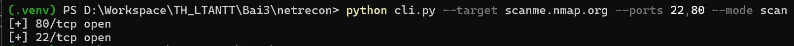

**CLI chế độ `all`.** Nmap nhận ra OpenSSH 6.6.1p1 và Apache 2.4.7, lấy được banner SSH,
kèm bảng ARP của máy:

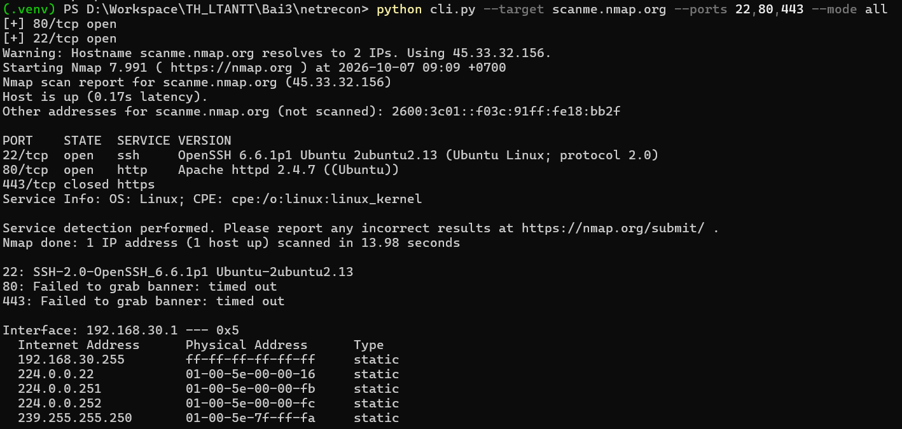

**Web Flask:** chạy server, điền form, kết quả hiện trên trang:

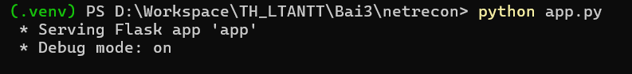
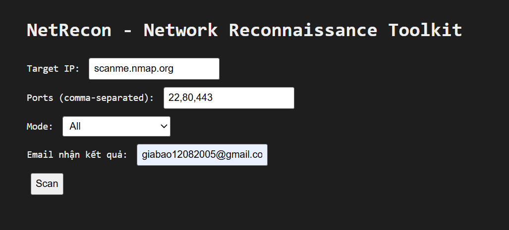
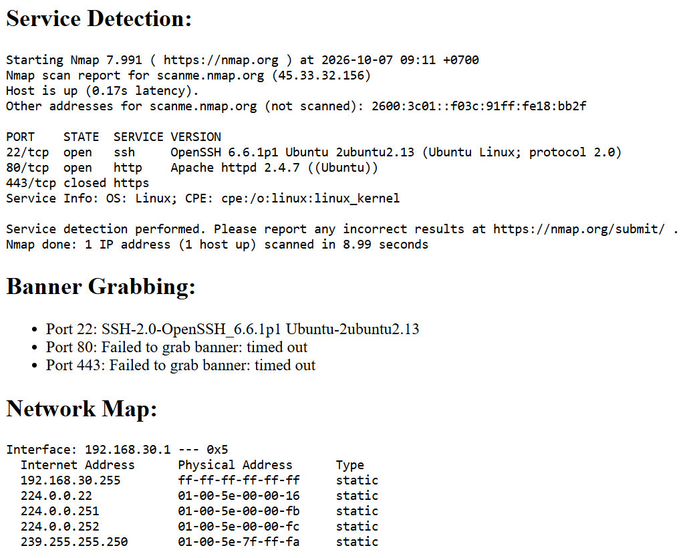

**Email kết quả gửi về Gmail:**

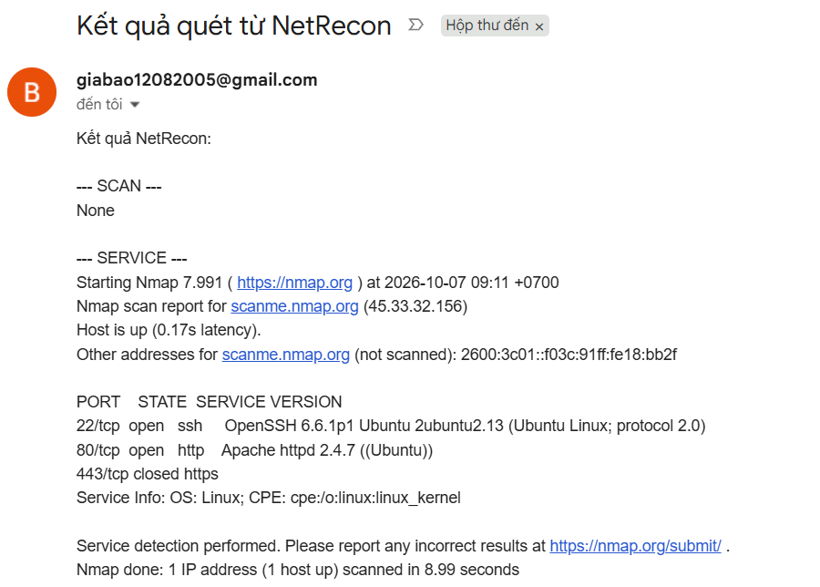

---

## Ghi chú so với code trong sách

Code giữ đúng như sách. Chỉ khác ở những chỗ sau:

- `make-certs.bat` theo bản ở trang 70, có `-config openssl.cnf`. Ảnh ở trang 71 thiếu
  tham số này, khi đó openssl sẽ hỏi từng trường thông tin thay vì đọc từ file cấu hình.
- `.env` để giá trị mẫu, không dùng email và mật khẩu in trong sách.
- `.gitignore` thêm `.env` (sách trang 89) và `netrecon.log` (log tự sinh khi chạy).

Một số hành vi của code gốc thấy được trong ảnh kết quả:

- Phần `SCAN` trong email và kết quả web luôn là `None`, vì `async_scan_ports` chỉ `print`
  cổng mở mà không trả về gì. Ảnh email trong sách (trang 92) cũng vậy.
- Banner cổng 80/443 báo `timed out`: web server chờ client gửi request trước, nên
  chỉ đọc mà không gửi gì thì không nhận được banner. Cổng 22 (SSH) thì server tự gửi banner trước.
- Khi client gõ `exit`, server in `Exception [WinError 10054]`. Lý do là client đóng socket
  mà không báo trước. Server vẫn dọn dẹp kết nối bình thường trong khối `finally`.
- `index.html` có `hx-post`, nhưng `layout.html` không nạp thư viện htmx, nên form gửi
  POST thông thường và trang kết quả thay cho trang form.
